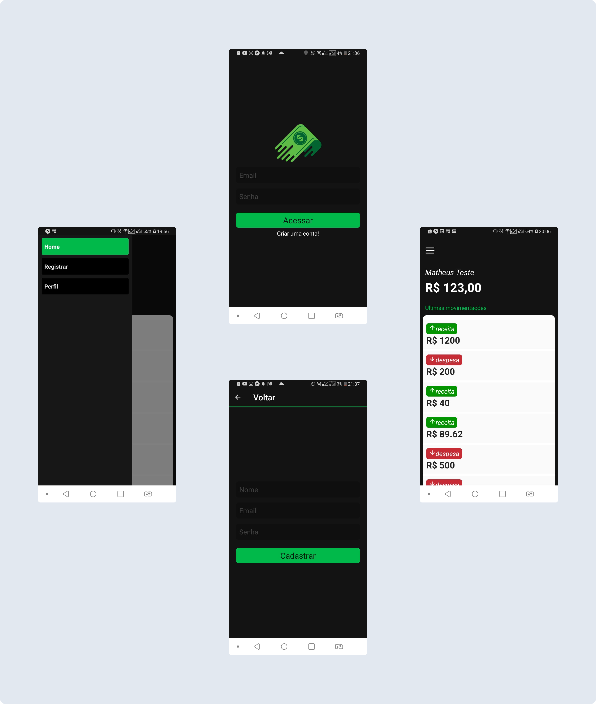

<p align='center'></p>

 <p align='center'>


 
</p>

## 🚀 Tecnologias

Esse projeto está utilizando as seguintes tecnologias:

- [ReactNative](https://reactnative.dev/)
- [Expo](https://expo.dev/)
- [StyledComponents](https://styled-components.com/)

## ⚙️ Como funciona?

- Crie uma conta
- Faça login
- Cadastre suas receitas e dispesas

## 🎲 Quer customizar o projeto?

### Clone esse repositório

```bash
git clone https://github.com/Savio-Anjos/guess-the-word.git

```

### Navegue até o diretório do projeto

```bash
cd Finance-App
```

### Instale as dependências

```bash
npm i
```

```bash
yarn
```

### Inicie a aplicação

```bash
yarn start
npm start
```

## 🖼️ Layout



---

<p>Criado com 💙 por <a href='https://github.com/Savio-Anjos/' target='_blank'>Sávio Anjos</a></p>
